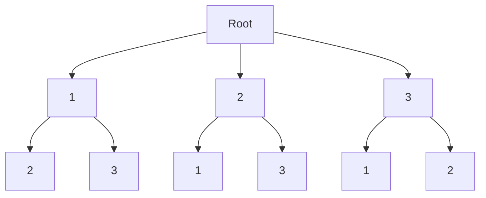
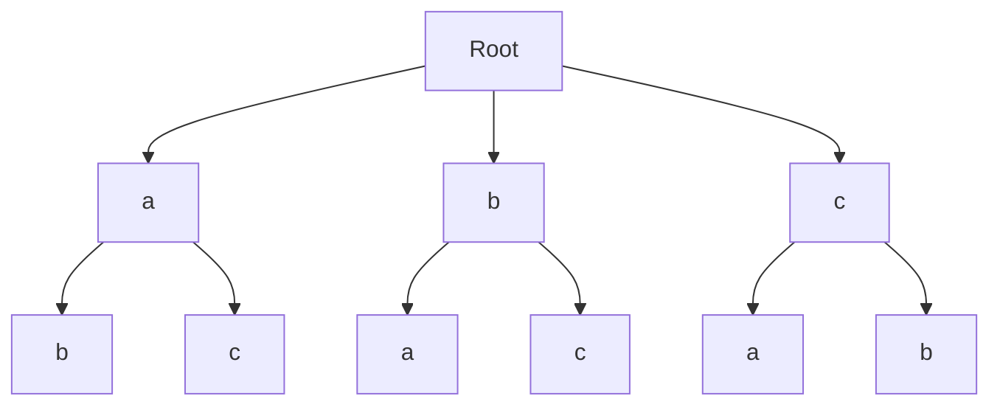

# DFS


## [面试题 08.10. 颜色填充](https://leetcode.cn/problems/color-fill-lcci/)

编写函数，实现许多图片编辑软件都支持的「颜色填充」功能。

待填充的图像用二维数组 image 表示，元素为初始颜色值。初始坐标点的行坐标为 sr 列坐标为 sc。需要填充的新颜色为 newColor 。

「周围区域」是指颜色相同且在上、下、左、右四个方向上存在相连情况的若干元素。

请用新颜色填充初始坐标点的周围区域，并返回填充后的图像。


### 示例

> 输入：
> image = [[1,1,1],[1,1,0],[1,0,1]] 
> sr = 1, sc = 1, newColor = 2
> 输出：[[2,2,2],[2,2,0],[2,0,1]]
> 解释: 
> 初始坐标点位于图像的正中间，坐标 (sr,sc)=(1,1) 。
> 初始坐标点周围区域上所有符合条件的像素点的颜色都被更改成 2 。
> 注意，右下角的像素没有更改为 2 ，因为它不属于初始坐标点的周围区域

#### **提示：**

- image 和 image[0] 的长度均在范围 [1, 50] 内。

- 初始坐标点 (sr,sc) 满足 0 <= sr < image.length 和 0 <= sc < image[0].length 。
- image[i][j] 和 newColor 表示的颜色值在范围 [0, 65535] 内。

### 题解

题目求得是与起点相连的区域内，填充颜色。dfs遍历整个区域设置上新颜色即可。我们目标是遍历所有点，不需要提前退出，所以没有退出条件。

需要注意的是，如果填充颜色和原始颜色一样，就没有必要运行dfs， 因为我们的代码是通过是否等于原始颜色来间接判断有没有访问过，如果颜色一样，DFS就会死循环。

```c
// 共享的全局变量
int oldColor = 0;
int _newColor = 0;
int rowSize = 0;
int colSize = 0;
int** map = NULL;

void dfs(int row, int col) {
    // 填充颜色
    map[row][col] = _newColor;

    {
        // 上
        int next_row = row - 1;
        int next_col = col;

        // 判断坐标范围
        if(next_row >=0 && next_row < rowSize && next_col >=0 && next_col < colSize)
        {
            // 如果等于原始颜色
            if(map[next_row][next_col] == oldColor)
            {
                // 转移到下一个位置
                dfs(next_row, next_col); 
            }
        }
    }

    {
        // 下
        int next_row = row + 1;
        int next_col = col;

        if(next_row >=0 && next_row < rowSize && next_col >=0 && next_col < colSize)
        {
            if(map[next_row][next_col] == oldColor)
            {
                dfs(next_row, next_col); 
            }
        }
    }

    {
        // 左
        int next_row = row;
        int next_col = col - 1;

        if(next_row >=0 && next_row < rowSize && next_col >=0 && next_col < colSize)
        {
            if(map[next_row][next_col] == oldColor)
            {
                dfs(next_row, next_col); 
            }
        }
    }

    {
        // 右
        int next_row = row;
        int next_col = col + 1;

        if(next_row >=0 && next_row < rowSize && next_col >=0 && next_col < colSize)
        {
            if(map[next_row][next_col] == oldColor)
            {
                dfs(next_row, next_col); 
            }
        }
    }
}

int** floodFill(int** image, int imageSize, int* imageColSize, int sr, int sc, int newColor, int* returnSize, int** returnColumnSizes) {
    oldColor = image[sr][sc];
    _newColor = newColor;
    rowSize = imageSize;
    colSize = imageColSize[0]; // 因为每一行长度相等，所以只取第一行的长度
    map = image;

    // 如果颜色一样，跳过DFS
    if(oldColor != _newColor)
        dfs(sr, sc);

    *returnSize = imageSize;
    *returnColumnSizes = imageColSize;
    return image;
}
```

可以发现我们写了很多重复代码，每段代码差异很小，我们用一个数组将方向保存下来简化我们的代码

```c
int dir[4][2] = {
    {-1,0}, // 上
    {1,0}, // 下
    {0,-1}, // 左
    {0,1},// 右
};
```

数组第一维度代表方向，第二维代表行和列偏移

完整代码如下：

```c
int oldColor = 0;
int _newColor = 0;
int rowSize = 0;
int colSize = 0;
int** map = NULL;

int dir[4][2] = {
    {-1,0}, // 上
    {1,0}, // 下
    {0,-1}, // 左
    {0,1},// 右
};

void dfs(int row, int col) {
    map[row][col] = _newColor;

    for(int i=0; i<4; i++){
       	
        int next_row = row + dir[i][0]; // 加上第i的方向的行偏移
        int next_col = col + dir[i][1]; // 加上第i的方向的列偏移
		// 注意永远不要修改当前的状态，我们的偏移是相对当前状态的，如果修改了，下一个方向的计算会出问题
        // 比如： row = row + dir[i][0]
        if(next_row >=0 && next_row < rowSize && next_col >=0 && next_col < colSize)
        {
            if(map[next_row][next_col] == oldColor)
            {
                dfs(next_row, next_col); 
            }
        }
    }
}

int** floodFill(int** image, int imageSize, int* imageColSize, int sr, int sc, int newColor, int* returnSize, int** returnColumnSizes) {
    oldColor = image[sr][sc];
    _newColor = newColor;
    rowSize = imageSize;
    colSize = imageColSize[0];
    map = image;

    if(oldColor != _newColor)
        dfs(sr, sc);

    *returnSize = imageSize;
    *returnColumnSizes = imageColSize;
    return image;
}
```

## [547. 省份数量](https://leetcode.cn/problems/number-of-provinces/)

有 n 个城市，其中一些彼此相连，另一些没有相连。如果城市 a 与城市 b 直接相连，且城市 b 与城市 c 直接相连，那么城市 a 与城市 c 间接相连。

省份 是一组直接或间接相连的城市，组内不含其他没有相连的城市。

给你一个 n x n 的矩阵 isConnected ，其中 isConnected[i][j] = 1 表示第 i 个城市和第 j 个城市直接相连，而 isConnected[i][j] = 0 表示二者不直接相连。

返回矩阵中 省份 的数量。


**示例 1：**


```
输入：isConnected = [[1,1,0],[1,1,0],[0,0,1]]
输出：2
```

### 题解

题目的是输入是个临接表，可以很容易知道当前城市连接的下一个城市。

为了不重复遍历需要定义一个visited数组。

和 颜色填充的区别在于，题目求的是联通的图的个数，而非单个联通图的遍历，所以我们要遍历所有城市发现所有的联通图，在遍历的过程中我们发现已经访问过，就表示这个城市已经在与之前的城市联通，直接跳过即可。

```c
#define MAX_N 200
int visited[MAX_N];
int **map = NULL;
int cities = 0;
void dfs(int i) {
    // 标记i为访问过
    visited[i] = 1;

    for (int j = 0; j < cities; j++) {
        // 如果i和j相连即map[i][j] == 1, 并且没有访问过，
        if (map[i][j] == 1 && !visited[j]) {
          
			//则跳到到下个城市
            dfs(j);
        }
    }
}

int findCircleNum(int** isConnected, int isConnectedSize, int* isConnectedColSize) {
    cities = isConnectedSize;
    map = isConnected;
 
    // 初始化visited数组
    for(int i = 0; i< cities;i++)
    {
        visited[i] = 0;
	}
 
    int provinces = 0;  // 初始化为0
   
    // 遍历所有城市
    for (int i = 0; i < cities; i++) {
        // 如果没有访问过就DFS搜索与他相连的城市
        if (!visited[i]) {
            dfs(i);
            // 搜索完加1
            provinces++;
        }
    }
    return provinces;
}
```

## [200. 岛屿数量](https://leetcode.cn/problems/number-of-islands/)

给你一个由 '1'（陆地）和 '0'（水）组成的的二维网格，请你计算网格中岛屿的数量。

岛屿总是被水包围，并且每座岛屿只能由水平方向和/或竖直方向上相邻的陆地连接形成。

此外，你可以假设该网格的四条边均被水包围。

 

示例 1：


输入：grid = [
  ["1","1","1","1","0"],
  ["1","1","0","1","0"],
  ["1","1","0","0","0"],
  ["0","0","0","0","0"]
]
输出：1


示例 2：

输入：grid = [
  ["1","1","0","0","0"],
  ["1","1","0","0","0"],
  ["0","0","1","0","0"],
  ["0","0","0","1","1"]
]
输出：3


提示：

- m == grid.length
- n == grid[i].length
- 1 <= m, n <= 300
- grid[i][j] 的值为 '0' 或 '1'


### 题解

这道题和省份数量数量的区别只是输入不同，题目并没有给连通图，我们需要根据位置计算出联通的下一个位置。

所以我么结合上边两道题目的经验，就可以写出来。需要注意map里面保存的是字符’0‘和’1‘， 而非数字0和1

```c
#define MAX_SIZE 300

char** map= NULL;
int visited[MAX_SIZE][MAX_SIZE] ={0};

int M = 0; // 行数
int N = 0; // 列数

int dir[4][2] = {
    {-1,0}, // 上
    {1,0}, // 下
    {0,-1}, // 左
    {0,1},// 右
};

void dfs(int row, int col)
{
    // 标记为访问过
    visited[row][col] = 1;

    for(int i=0; i<4; i++){
       	
        int next_row = row + dir[i][0]; // 加上第i的方向的行偏移
        int next_col = col + dir[i][1]; // 加上第i的方向的列偏移
		// 注意永远不要修改当前的状态，我们的偏移是相对当前状态的，如果修改了，下一个方向的计算会出问题
        // 比如： row = row + dir[i][0]
        if(next_row >=0 && next_row < M && next_col >=0 && next_col < N)
        {
            if(map[next_row][next_col] == '1' && !visited[next_row][next_col])
            {
                dfs(next_row, next_col); 
            }
        }
    }
}

int numIslands(char** grid, int gridSize, int* gridColSize){
    map = grid;
    M = gridSize;
    N = gridColSize[0]; // 因为每一行长度相等，所以只取第一行的长度

    // 初始化visited数组
    for(int i = 0; i< M;i++)
    {
        for(int j = 0; j< N;j++)
        {
            visited[i][j] = 0;
        }
    }

    int count = 0; // 初始化为0

    for(int i = 0; i< M;i++) //遍历行
    {
        for(int j = 0; j< N;j++) // 遍历列
        {
            // 如果没有访问过就DFS搜索与他相连的陆地
            if(map[i][j] == '1' && !visited[i][j])
            {
                dfs(i,j);
                // 搜索完加1
                count++;
            }
        }
    }
    return count;
}
```

## [130. 被围绕的区域](https://leetcode.cn/problems/surrounded-regions/)

给你一个 m x n 的矩阵 board ，由若干字符 'X' 和 'O' ，找到所有被 'X' 围绕的区域，并将这些区域里所有的 'O' 用 'X' 填充。


示例 1：


输入：board = [["X","X","X","X"],["X","O","O","X"],["X","X","O","X"],["X","O","X","X"]]
输出：[["X","X","X","X"],["X","X","X","X"],["X","X","X","X"],["X","O","X","X"]]
解释：被围绕的区间不会存在于边界上，换句话说，任何边界上的 'O' 都不会被填充为 'X'。 任何不在边界上，或不与边界上的 'O' 相连的 'O' 最终都会被填充为 'X'。如果两个元素在水平或垂直方向相邻，则称它们是“相连”的。
示例 2：

输入：board = [["X"]]
输出：[["X"]]


提示：

- m == board.length

- n == board[i].length
- 1 <= m, n <= 200
- board[i][j] 为 'X' 或 'O'
- 通过次数177,058提交次数388,125


### 题解

直接找到被X包围的O比较困难，可以反过来考虑，找到没有被包围的O, 然后没有访问过的O就是被包围的。

我们直接在岛屿数量的基础上改，但是只遍历图边缘的O, 也就是第一行，最后一行，第一列，最后一列

```c
#define MAX_SIZE 200

char** map= NULL;
int visited[MAX_SIZE][MAX_SIZE] ={0};

int M = 0; // 行数
int N = 0; // 列数

int dir[4][2] = {
    {-1,0}, // 上
    {1,0}, // 下
    {0,-1}, // 左
    {0,1},// 右
};

void dfs(int row, int col)
{
    // 标记为访问过
    visited[row][col] = 1;

    for(int i=0; i<4; i++){
       	
        int next_row = row + dir[i][0]; // 加上第i的方向的行偏移
        int next_col = col + dir[i][1]; // 加上第i的方向的列偏移
		// 注意永远不要修改当前的状态，我们的偏移是相对当前状态的，如果修改了，下一个方向的计算会出问题
        // 比如： row = row + dir[i][0]
        if(next_row >=0 && next_row < M && next_col >=0 && next_col < N)
        {
            if(map[next_row][next_col] == 'O' && !visited[next_row][next_col])
            {
                dfs(next_row, next_col); 
            }
        }
    }
}

void solve(char** board, int boardSize, int* boardColSize){
    map = board;
    M = boardSize;
    N = boardColSize[0]; // 因为每一行长度相等，所以只取第一行的长度

    // 初始化visited数组
    for(int i = 0; i< M;i++)
    {
        for(int j = 0; j< N;j++)
        {
            visited[i][j] = 0;
        }
    }

    int count = 0; // 初始化为0

    for(int i = 0; i< M;i++) //遍历第一列
    {
        // 如果没有访问过就DFS搜索与他相连的区域
        if(map[i][0] == 'O' && !visited[i][0])
        {
            dfs(i,0);
        }
    }

    for(int i = 0; i< M;i++) //遍历最后一列
    {
        // 如果没有访问过就DFS搜索与他相连的区域
        if(map[i][N-1] == 'O' && !visited[i][N-1])
        {
            dfs(i,N-1);
        }
    }

    for(int j = 0; j< N;j++) //遍历第一行
    {
        // 如果没有访问过就DFS搜索与他相连的区域
        if(map[0][j] == 'O' && !visited[0][j])
        {
            dfs(0,j);
        }
    }

    for(int j = 0; j< N;j++) //遍历最后一行
    {
        // 如果没有访问过就DFS搜索与他相连的区域
        if(map[M-1][j] == 'O' && !visited[M-1][j])
        {
            dfs(M-1, j);
        }
    }
    
    for(int i = 0; i< M;i++) //遍历行
    {
        for(int j = 0; j< N;j++) // 遍历列
        {
            // 没有访问过的O就是被包围的区域
            if(map[i][j] == 'O' && !visited[i][j])
            {
                map[i][j] = 'X';
            }
        }
    }
}
```

相似题目： [1020. 飞地的数量](https://leetcode.cn/problems/number-of-enclaves/)  [1254. 统计封闭岛屿的数目](https://leetcode.cn/problems/number-of-closed-islands/)

## [79. 单词搜索](https://leetcode.cn/problems/word-search/)

给定一个 m x n 二维字符网格 board 和一个字符串单词 word 。如果 word 存在于网格中，返回 true ；否则，返回 false 。

单词必须按照字母顺序，通过相邻的单元格内的字母构成，其中“相邻”单元格是那些水平相邻或垂直相邻的单元格。同一个单元格内的字母不允许被重复使用。

 

示例 1：


输入：board = [["A","B","C","E"],["S","F","C","S"],["A","D","E","E"]], word = "ABCCED"
输出：true
示例 2：


输入：board = [["A","B","C","E"],["S","F","C","S"],["A","D","E","E"]], word = "SEE"
输出：true
示例 3：


输入：board = [["A","B","C","E"],["S","F","C","S"],["A","D","E","E"]], word = "ABCB"
输出：false


提示：

- m == board.length

- n = board[i].length
- 1 <= m, n <= 6
- 1 <= word.length <= 15
- board 和 word 仅由大小写英文字母组成


进阶：你可以使用搜索剪枝的技术来优化解决方案，使其在 board 更大的情况下可以更快解决问题？

### 题解

这题的主要区别是判定是否一个区域的规则比较复杂，并且有顺序要求。

之前的题目并不关心搜索的顺序，只要找到一条路径即可，并且这个路径是一定符合题目要求。但是这个题目在路径搜索的过程中有失败的可能，一条路径失败，我们需要退回去寻找下一条路径，那么就需要状态回溯，不能让失败的状态影响我们下一次搜索。

就是说我们需要回复visited数组。代码如下：

```c
void dfs(int row, int col)
{
    // 标记为访问过
    visited[row][col] = 1;
    
    // 一些代码
    
    
    visited[row][col] = 0; //回溯
}
```

也可以这样写：

```c
void dfs(int row, int col)
{
     // 一些代码
    visited[row][col] = 1;
    dfs(int row, int col)
    visited[row][col] = 0; //回溯
    // 一些代码
}

int main ()
{
     // 一些代码
    visited[row][col] = 1;
    dfs(int row, int col)
    visited[row][col] = 0; //回溯
    // 一些代码
}
```

这两种方式没有什么本质区别，只是一个调用后，一个调用前。

如果dfs 有多处return, 调用后的写法，需要多处回溯操作，像这样子。比较麻烦，容易遗漏，就可以考虑使用调用前的写法。

```c
void dfs(int row, int col)
{
     // 一些代码
    visited[row][col] = 1;
    dfs(int row, int col)
    visited[row][col] = 0; //回溯
    // 一些代码
    
    {
	    visited[row][col] = 0; //回溯
    	return;
    }
    
     {
	    visited[row][col] = 0; //回溯
    	return;
    }
}
```

另外这题只要寻找一条路径，所以在找到之后，直接return, 避免不必要的开销。


完整答案：

```c
#define MAX_SIZE 6

char** map= NULL;
int visited[MAX_SIZE][MAX_SIZE] ={0};
int M = 0; // 行数
int N = 0; // 列数

int dir[4][2] = {
    {-1,0}, // 上
    {1,0}, // 下
    {0,-1}, // 左
    {0,1},// 右
};

char *_word = NULL;
int length = 0;

bool ans = false;
void dfs(int row, int col, int step)
{
    if(step >= length -1 )
    {
        // 如果找到，直接返回
        ans = true;
        return;
    }

    for(int i=0; i<4; i++){
       	
        int next_row = row + dir[i][0]; // 加上第i的方向的行偏移
        int next_col = col + dir[i][1]; // 加上第i的方向的列偏移
		// 注意永远不要修改当前的状态，我们的偏移是相对当前状态的，如果修改了，下一个方向的计算会出问题
        // 比如： row = row + dir[i][0]
        if(next_row >=0 && next_row < M && next_col >=0 && next_col < N)
        {
            if(map[next_row][next_col] == _word[step + 1] && !visited[next_row][next_col])
            {
                // 标记为访问过
                visited[next_row][next_col] = 1;
                dfs(next_row, next_col, step + 1);
                visited[next_row][next_col] = 0; //回溯状态
				
                // 如果找到，直接返回
                if(ans)
                    return;
            }
        }
    }
}


bool exist(char** board, int boardSize, int* boardColSize, char * word){
    map = board;
    M = boardSize;
    N = boardColSize[0];

    _word = word;
    length = strlen(word);
    ans = false;

    // 初始化visited数组
    for(int i = 0; i< M;i++)
    {
        for(int j = 0; j< N;j++)
        {
            visited[i][j] = 0;
        }
    }

    for(int i = 0; i< M;i++)
    {
        for(int j = 0; j< N;j++)
        {
            if(map[i][j] == word[0] && !visited[i][j])
            {
                // 标记为访问过
                visited[i][j] = 1;
                dfs(i,j, 0);
                visited[i][j] = 0;

                // 如果找到，直接返回
                if(ans)
                    return ans;
            }
        }
    }
    return ans;
}
```

## [剑指 Offer 13. 机器人的运动范围](https://leetcode.cn/problems/ji-qi-ren-de-yun-dong-fan-wei-lcof/)

地上有一个m行n列的方格，从坐标 [0,0] 到坐标 [m-1,n-1] 。一个机器人从坐标 [0, 0] 的格子开始移动，它每次可以向左、右、上、下移动一格（不能移动到方格外），也不能进入行坐标和列坐标的数位之和大于k的格子。例如，当k为18时，机器人能够进入方格 [35, 37] ，因为3+5+3+7=18。但它不能进入方格 [35, 38]，因为3+5+3+8=19。请问该机器人能够到达多少个格子？

 

示例 1：

输入：m = 2, n = 3, k = 1
输出：3
示例 2：

输入：m = 3, n = 1, k = 0
输出：1
提示：

- 1 <= n,m <= 100
- 0 <= k <= 20


### 题解

这题难点在求各位数之和，参考下面代码。

```c
int sum(int x){
    int sum = 0;
    while(x != 0){
        sum += x % 10; //加上最后一位
        x /= 10; //删除最后一位
    }
    return sum;
}
```

完整代码

```c
#define MAX_SIZE 100

int visited[MAX_SIZE][MAX_SIZE] ={0};
int M = 0; // 行数
int N = 0; // 列数
int K = 0;
int Count = 0;

int dir[4][2] = {
    {-1,0}, // 上
    {1,0}, // 下
    {0,-1}, // 左
    {0,1},// 右
};

int sum(int x){
    int sum = 0;
    while(x != 0){
        sum += x % 10;
        x /= 10;
    }
    return sum;
}

void dfs(int row, int col)
{
    visited[row][col] = 1;
    Count++;

    for(int i=0; i<4; i++){
       	
        int next_row = row + dir[i][0]; // 加上第i的方向的行偏移
        int next_col = col + dir[i][1]; // 加上第i的方向的列偏移
		// 注意永远不要修改当前的状态，我们的偏移是相对当前状态的，如果修改了，下一个方向的计算会出问题
        // 比如： row = row + dir[i][0]
        if(next_row >=0 && next_row < M && next_col >=0 && next_col < N)
        {
            if(sum(next_row) + sum(next_col) <= K && !visited[next_row][next_col])
            {
                // 标记为访问过
                dfs(next_row, next_col);
            }
        }
    }
}

int movingCount(int m, int n, int k){
    M=m;
    N=n;
    K =k;

    Count = 0;

    // 初始化visited数组
    for(int i = 0; i< M;i++)
    {
        for(int j = 0; j< N;j++)
        {
            visited[i][j] = 0;
        }
    }

    dfs(0,0);

    return Count;
}
```

## [全排列](https://vjudge.net/problem/OpenJ_Bailian-4070)

对于数组[1, 2, 3]，他们按照从小到大的全排列是

1 2 3

1 3 2

2 1 3

2 3 1

3 1 2

3 2 1

现在给你一个正整数n，n小于8，输出数组[1, 2, …，n]的从小到大的全排列。

##### Input

输入有多行，每行一个整数。当输入0时结束输入。

##### Output

对于每组输入，输出该组的全排列。每一行是一种可能的排列，共n个整数，每个整数用一个空格隔开，每行末尾没有空格。


### 题解

需要搜索所有path， 所以需要回溯操作，注意题目的输出格式。

和直接题目的不同在与需要记录走过的路径，这里直接定义一个path, 里面的存放走过的节点。

另外一个技巧, 题目的数值是1-N, 我们可以定义大1的数组，将第一个位置空出来。




```c
#include <stdio.h>

#define MAX_LEN 9

int path[MAX_LEN] = {0}; //用来记录走过的路径
int visited[MAX_LEN] = {0};
int N;

void dfs(int step)
{
    if (step >= N)
    {
        for (int i = 1; i <= N; i++)
        {
            // 输入需要满足题目要求
            if (i == 1)
                printf("%d", path[i]);
            else
                printf(" %d", path[i]);
        }
        printf("\n");
        return;
    }

    for (int i = 1; i <= N; i++)
    {
        if (visited[i] == 0)
        {
            path[step + 1] = i;
            visited[i] = 1;
            dfs(step + 1);
            visited[i] = 0;
        }
    }
}

int main()
{
    while (1)
    {
        scanf("%d", &N);

        // 为0就退出程序
        if (N == 0)
            break;

        // 初始化visited数组
        for (int i = 1; i <= N; i++)
        {
            visited[i] = 0;
        }

        dfs(0);
    }

    return 0;
}
```

## [字母的全排列](https://vjudge.net/problem/OpenJ_Bailian-2748)

描述

给定一个由不同的小写字母组成的字符串，输出这个字符串的所有全排列。 我们假设对于小写字母有'a' < 'b' < ... < 'y' < 'z'，而且给定的字符串中的字母已经按照从小到大的顺序排列。

输入

输入只有一行，是一个由不同的小写字母组成的字符串，已知字符串的长度在1到6之间。

输出

输出这个字符串的所有排列方式，每行一个排列。要求字母序比较小的排列在前面。字母序如下定义：

已知S = s1s2...sk , T = t1t2...tk，则S < T 等价于，存在p (1 <= p <= k)，使得
s1 = t1, s2 = t2, ..., sp - 1 = tp - 1, sp < tp成立。

样例输入

```
abc
```

样例输出

```
abc
acb
bac
bca
cab
cba
```


### 题解

就是将数字换成字母，稍微修改上一题答案。




```c
#include <stdio.h>

// 题目最大长度+1 ==7 因为还有末尾的\0
#define MAX_LEN 7

char path[MAX_LEN] = {0}; //节点状态是字符所以用char数组
int visited[MAX_LEN] = {0};
int N;

char str[MAX_LEN]  ={0};

void dfs(int step)
{
    if (step >= N)
    {
        path[N] = '\0'; //最后一个设置为空，不然打印可能有问题
        printf("%s\n", path);
        return;
    }

    for (int i = 0; i < N; i++)
    {
        if (visited[i] == 0)
        {
            path[step] = str[i];
            visited[i] = 1;
            dfs(step + 1);
            visited[i] = 0;
        }
    }
}

int main()
{
    // %s 输入一个字符串，注意不要用%c, 坑太多, 字符串输入统一用%s
    scanf("%s", str);
    N = strlen(str); //或字符长度

    for (int i = 0; i < N; i++)
    {
        visited[i] = 0;
    }

    dfs(0);

    return 0;
}
```

## [Order](https://vjudge.net/problem/POJ-1731)

The stores manager has sorted all kinds of goods in an alphabetical order of their labels. All the kinds having labels starting with the same letter are stored in the same warehouse (i.e. in the same building) labelled with this letter. During the day the stores manager receives and books the orders of goods which are to be delivered from the store. Each order requires only one kind of goods. The stores manager processes the requests in the order of their booking.

You know in advance all the orders which will have to be processed by the stores manager today, but you do not know their booking order. Compute all possible ways of the visits of warehouses for the stores manager to settle all the demands piece after piece during the day.

##### Input

Input contains a single line with all labels of the requested goods (in random order). Each kind of goods is represented by the starting letter of its label. Only small letters of the English alphabet are used. The number of orders doesn't exceed 200.

##### Output

Output will contain all possible orderings in which the stores manager may visit his warehouses. Every warehouse is represented by a single small letter of the English alphabet -- the starting letter of the label of the goods. Each ordering of warehouses is written in the output file only once on a separate line and all the lines containing orderings have to be sorted in an alphabetical order (see the example). No output will exceed 2 megabytes.


##### Sample

| Input   | Output                                                       |
| ------- | ------------------------------------------------------------ |
| `bbjd ` | `bbdj bbjd bdbj bdjb bjbd bjdb dbbj dbjb djbb jbbd jbdb jdbb` |

### 题解

这题目的输入并不是个字典序排列的字符串，并且有多个相同字母。考虑一个26大小的int数组, 如果值为0表示没有这个字母，如果为1，表示这个字母可以使用一次， 大于0表示可以使用多次。我们直接复用了上一道的visited数组，改成remain, 表示可用的字母数量。

另外需要掌握字符和数字的转化

```
char c;
c-'a'; // 'a' - 'z' 转化为 0 -26
int number;
number+'a'; // 0 -26 转化为 'a' - 'z' 
```

完整代码

```c
#include <stdio.h>

// 题目最大长度+1 ==201 因为还有末尾的\0
#define MAX_LEN 201

char path[MAX_LEN] = {0};
int remain[26] = {0};
int N;

char str[MAX_LEN]  ={0};

void dfs(int step)
{
    if (step >= N)
    {
        // 这个不能用%c, 直接%s 打印整个字符串，因为%c比较慢，无法通过
        printf("%s\n", path);
        return;
    }

    for (int i = 0; i < 26; i++)
    {
        if (remain[i] > 0)
        {
            path[step] = i + 'a'; // 数字转字符
            remain[i]--;
            dfs(step + 1);
            remain[i]++;
        }
    }
}

int main()
{
    scanf("%s", str);
    N = strlen(str);

    // 初始化remain数组
    for (int i = 0; i < 26; i++)
    {
        remain[i] = 0;
    }

    // 统计每个字母的个数
    for (int i = 0; i < N; i++)
    {
        // str[i] - 'a' 字符转数字
        remain[str[i] - 'a']++; 
    }

    dfs(0);

    return 0;
}
```

## [Anagram](https://vjudge.net/problem/POJ-1256) （排列）

You are to write a program that has to generate all possible words from a given set of letters.
Example: Given the word "abc", your program should - by exploring all different combination of the three letters - output the words "abc", "acb", "bac", "bca", "cab" and "cba".
In the word taken from the input file, some letters may appear more than once. For a given word, your program should not produce the same word more than once, and the words should be output in alphabetically ascending order.

##### Input

The input consists of several words. The first line contains a number giving the number of words to follow. Each following line contains one word. A word consists of uppercase or lowercase letters from A to Z. Uppercase and lowercase letters are to be considered different. The length of each word is less than 13.

##### Output

For each word in the input, the output should contain all different words that can be generated with the letters of the given word. The words generated from the same input word should be output in alphabetically ascending order. An upper case letter goes before the corresponding lower case letter.

##### Sample

| Inputcopy         | Output                                                       |
| ----------------- | ------------------------------------------------------------ |
| `3 aAb abc acba ` | `Aab Aba aAb abA bAa baA abc acb bac bca cab cba aabc aacb abac abca acab acba baac baca bcaa caab caba cbaa` |

### 题解

和上面类似，但有几点区别

1. 小写+大写
2. 注意字母顺序不是ascii 顺序

这里没有使用上一题的思路，因为题目的输入较短，而字母有26*2个， 没必要搜索不存在的字母。

我们对原始输入排序，获得可用的字母。这里针对这个题目使用了一个技巧用来比较。

我们将a-z 映射为2，4，6，8, A-Z映射为1，3，5，7，代码如下

```c
int cmp(char c1, char c2)
{
    int order1 = (c1 >= 'a' && c1 <= 'z') ? ((c1 - 'a') * 2 + 1) : ((c1 - 'A') * 2);
    int order2 = (c2 >= 'a' && c2 <= 'z') ? ((c2 - 'a') * 2 + 1) : ((c2 - 'A') * 2);

    return order1 - order2;
}
```

排序直接使用冒泡：

```c
void sort(char *s, int length)
{
    for (int i = 0; i < length - 1; i++)
    {
        for (int j = 0; j < length - 1 - i; j++)
        {

            if (cmp(s[j], s[j + 1]) > 0)
            {
                char a = s[j + 1];
                s[j + 1] = s[j];
                s[j] = a;
            }
        }
    }
}
```

这样我们获得一个排序后字符串，DFS基于这个字符串搜索。这题我们没有使用remain数组，为了保证不重复遍历，需要在dfs后，跳过相同的字母。

```c
            for (int j = i + 1; j < N; j++)
            {
                if (str[i] == str[j])
                    i++;
            }
```

#### 完整代码

```c
#include <stdio.h>

// 题目最大长度+1 ==14 因为还有末尾的\0
#define MAX_LEN 14

char path[MAX_LEN] = {0};
int visited[MAX_LEN] = {0};

int N;

char str[MAX_LEN] = {0};

int cmp(char c1, char c2)
{
    int order1 = (c1 >= 'a' && c1 <= 'z') ? ((c1 - 'a') * 2 + 1) : ((c1 - 'A') * 2);
    int order2 = (c2 >= 'a' && c2 <= 'z') ? ((c2 - 'a') * 2 + 1) : ((c2 - 'A') * 2);

    return order1 - order2;
}

void sort(char *s, int length)
{
    for (int i = 0; i < length - 1; i++)
    {
        for (int j = 0; j < length - 1 - i; j++)
        {

            if (cmp(s[j], s[j + 1]) > 0)
            {
                char a = s[j + 1];
                s[j + 1] = s[j];
                s[j] = a;
            }
        }
    }
}

void dfs(int step)
{
    if (step >= N)
    {
        path[N] = '\0'; //最后一个设置为空，不然打印可能有问题
        printf("%s\n", path);
        return;
    }

    for (int i = 0; i < N; i++)
    {
        if (visited[i] == 0)
        {
            path[step] = str[i];
            visited[i] = 1;
            dfs(step + 1);
            visited[i] = 0;

            for (int j = i + 1; j < N; j++)
            {
                if (str[i] == str[j])
                    i++;
            }
        }
    }
}

int main()
{
    int T;
    scanf("%d", &T);

    for (int n = 0; n < T; n++)
    {
        scanf("%s", str);
        N = strlen(str);

        // 初始化visited数组
        for (int i = 0; i < N; i++)
        {
            visited[i] = 0;
        }

        // 统计每个字母的个数
        sort(str, N);
        dfs(0);
    }

    return 0;
}
```


练手题目： [Backward Digit **Sums**](http://poj.org/problem?id=3187)


## [Lotto](https://vjudge.net/problem/POJ-2245) (组合)

In the German Lotto you have to select 6 numbers from the set {1,2,...,49}. A popular strategy to play Lotto - although it doesn't increase your chance of winning - is to select a subset S containing k (k > 6) of these 49 numbers, and then play several games with choosing numbers only from S. For example, for k=8 and S = {1,2,3,5,8,13,21,34} there are 28 possible games: [1,2,3,5,8,13], [1,2,3,5,8,21], [1,2,3,5,8,34], [1,2,3,5,13,21], ... [3,5,8,13,21,34].

Your job is to write a program that reads in the number k and the set S and then prints all possible games choosing numbers only from S.

Input

The input will contain one or more test cases. Each test case consists of one line containing several integers separated from each other by spaces. The first integer on the line will be the number k (6 < k < 13). Then k integers, specifying the set S, will follow in ascending order. Input will be terminated by a value of zero (0) for k.

Output

For each test case, print all possible games, each game on one line. The numbers of each game have to be sorted in ascending order and separated from each other by exactly one space. The games themselves have to be sorted lexicographically, that means sorted by the lowest number first, then by the second lowest and so on, as demonstrated in the sample output below. The test cases have to be separated from each other by exactly one blank line. Do not put a blank line after the last test case.

### 题解

组合题目，选6个，按字典序排列。建议自己尝试编写一下。

```c
#include <stdio.h>

#define MAX_LEN 13

int path[6] = {0};
int N;
int arr[MAX_LEN] = {0};

void dfs(int deep, int start)
{
    // 选满6个数字
    if (deep >= 6)
    {
        for (int i = 0; i < 6; i++)
        {
            printf("%d ", path[i]);
        }
        printf("\n");
        return;
    }

    // 从start-N中选择下一个数字
    for (int i = start; i < N; i++)
    {
        path[deep] = arr[i];
        dfs(deep + 1, i + 1);
    }
}

int main()
{
    while (1)
    {
        scanf("%d", &N);

        if (N == 0)
            break;

        for (int i = 0; i < N; i++)
        {
            scanf("%d", &arr[i]);
        }
        dfs(0, 0);
        printf("\n"); //满足题目格式要求
    }

    return 0;
}
```

## 总结

颜色填充: 指定了起点的，只要搜索这个联通区域，并且不关心搜索顺序，只要找到覆盖所有点即可

省份数量: 没有指定起点，存在多个联通区域，并且不关心搜索顺序，只要找到覆盖所有点即可。

岛屿数量: 同上，区别是上面直接给的临接表，而这题和颜色填充一样需要上下左右搜索

被围绕的区域： 类似，但需要逆向思维

单词搜索：没有指定起点，关心搜索顺序，存在路径失败，一旦失败需要回溯

机器人的运动范围：重点是十进制数的分解

排列组合难度不大，但是需要很多技巧，以及掌握排序算法。特别是[Anagram](https://vjudge.net/problem/POJ-1256)  相对复杂点。另外有重复元素，需要避免重复搜索。