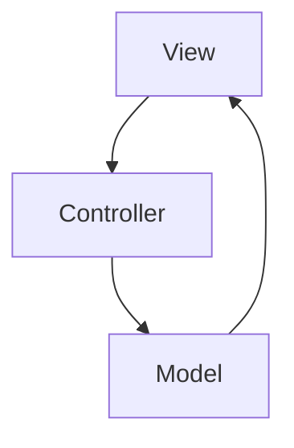
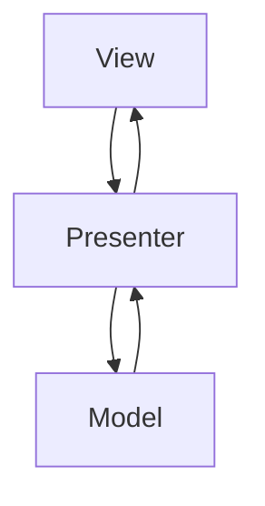

# React 入门


## 声明式UI

先统一一下概念，我们有两种编程方式：命令式和声明式。

我们可以像下面这样定义它们之间的不同：

- **命令式**：命令“机器”*如何*去做事情*(how)*，这样不管你想要的*是什么(what)*，它都会按照你的命令实现。
- **声明式**：告诉“机器”你想要的*是什么(what)*，让机器想出*如何*去做*(how)*。

#### 

```java
// Imperative style
b.setColor(red)
b.clearChildren()
ViewC c3 = new ViewC(...)
b.add(c3)
```

```dart
// Declarative style
return ViewB(
  color: red,
  child: ViewC(...),
)
```


其实声明式 UI 并不是什么新技术，早在 2006 年，微软就已经发布了其新一代界面开发框架 **WPF**，其采用了 XAML 标记语言，支持双向数据绑定、可复用模板等特性。


### 复杂点的例子
#### 远古Java Swing 示例代码

```java
private static void placeComponents(JPanel panel) {
    panel.setLayout(null);

    JLabel userLabel = new JLabel("User:");
    userLabel.setBounds(10,20,80,25);
    panel.add(userLabel);

    JTextField userText = new JTextField(20);
    userText.setBounds(100,20,165,25);
    panel.add(userText);
    JLabel passwordLabel = new JLabel("Password:");
    passwordLabel.setBounds(10,50,80,25);
    panel.add(passwordLabel);

    JPasswordField passwordText = new JPasswordField(20);
    passwordText.setBounds(100,50,165,25);
    panel.add(passwordText);

    JButton loginButton = new JButton("login");
    loginButton.setBounds(10, 80, 80, 25);
    panel.add(loginButton);
}
```

是否写过类似的代码？


去除临时变量，优化层次结构：

```Java
private static JPanel render() {
    return JPanel(
        JLabel("User:")
        	.Bounds(10,20,80,25),
        JTextField(20)
        	.Bounds(100,20,165,25),
        JLabel("Password:")
        	.Bounds(10,50,80,25),
        JPasswordField(20)
        	.Bounds(100,50,165,25),
        JButton("login")
        	.Bounds(10, 80, 80, 25),
    )
}
```

### 其他UI语言或框架

#### Jetpack Compose （google）

https://developer.android.com/jetpack/compose?hl=zh-cn

```kotlin
@Composable
fun SearchResult(...) {
  Row(...) {
    Image(...)
    Column(...) {
      Text(...)
      Text(..)
    }
  }
}
```


#### SwiftUI (apple)

https://developer.apple.com/documentation/swiftui/building-layouts-with-stack-views

```swift
struct ProfileView: View {
    var body: some View {
        ZStack(alignment: .bottom) {
            Image("ProfilePicture")
                .resizable()
                .aspectRatio(contentMode: .fit)
            HStack {
                VStack(alignment: .leading) {
                    Text("Rachael Chiseck")
                        .font(.headline)
                    Text("Chief Executive Officer")
                        .font(.subheadline)
                }
                Spacer()
            }
            .padding()
            .foregroundColor(.primary)
            .background(Color.primary
                            .colorInvert()
                            .opacity(0.75))
        }
    }
}
```

#### Flutter (google)

https://docs.flutter.dev/development/ui/layout/tutorial

```dart
Widget titleSection = Container(
  padding: const EdgeInsets.all(32),
  child: Row(
    children: [
      Expanded(
        /*1*/
        child: Column(
          crossAxisAlignment: CrossAxisAlignment.start,
          children: [
            /*2*/
            Container(
              padding: const EdgeInsets.only(bottom: 8),
              child: const Text(
                'Oeschinen Lake Campground',
                style: TextStyle(
                  fontWeight: FontWeight.bold,
                ),
              ),
            ),
            Text(
              'Kandersteg, Switzerland',
              style: TextStyle(
                color: Colors.grey[500],
              ),
            ),
          ],
        ),
      ),
      /*3*/
      Icon(
        Icons.star,
        color: Colors.red[500],
      ),
      const Text('41'),
    ],
  ),
);
```


#### QML  (qt)

https://doc.qt.io/qt-5/qmlfirststeps.html

```qml
//import related modules
import QtQuick 2.12
import QtQuick.Controls 2.12

//window containing the application
ApplicationWindow {

    visible: true

    //title of the application
    title: qsTr("Hello World")
    width: 640
    height: 480

    //menu containing two menu items
    menuBar: MenuBar {
        Menu {
            title: qsTr("File")
            MenuItem {
                text: qsTr("&Open")
                onTriggered: console.log("Open action triggered");
            }
            MenuItem {
                text: qsTr("Exit")
                onTriggered: Qt.quit();
            }
        }
    }

    //Content Area

    //a button in the middle of the content area
    Button {
        text: qsTr("Hello World")
        anchors.horizontalCenter: parent.horizontalCenter
        anchors.verticalCenter: parent.verticalCenter
    }
}
```

#### XAML (microsoft)

https://docs.microsoft.com/en-us/dotnet/desktop/wpf/xaml/?view=netdesktop-6.0

```xaml
<Button>
    <Button.Background>
        <SolidColorBrush Color="Blue"/>
    </Button.Background>
    <Button.Foreground>
        <SolidColorBrush Color="Red"/>
    </Button.Foreground>
    <Button.Content>
        This is a button
    </Button.Content>
</Button>
```

#### JSX (facebook)

```jsx
render() {
    return <JPanel>
        <JLabel bounds={[10,20,80,25]}>User:</JLabel>
        <JTextField bounds={[100,20,165,25]} length={20}/>
        <JLabel bounds={[10,50,80,25]}>Password:</JLabel>
        <JPasswordField bounds={[100,50,165,2]} length={20} />
        <JButton bounds={[10, 80, 80, 25]}>login</JButton>
    </JPanel>
}
```

## JSX 简介 

官方介绍 https://zh-hans.reactjs.org/docs/introducing-jsx.html

设想如下变量声明

```jsx
const element = <h1>Hello, world!</h1>;
```

上述这个有趣的标签语法既不是字符串也不是 HTML。

它被称为 JSX，是一个 JavaScript 的语法扩展。我们在 React 建议中配合使用 JSX，JSX 可以很好地描述 UI 应该呈现出它应有交互的本质形式。JSX 可能会使人联想到模板语言，但它具有 JavaScript 的全部功能。

#### 为什么使用 JSX？

React 认为渲染逻辑本质上与其他 UI 逻辑内在耦合，比如，在 UI 中需要绑定处理事件、在某些时刻状态发生变化时需要通知到 UI，以及需要在 UI 中展示准备好的数据。

React 并没有采用将*标记与逻辑进行分离到不同文件*这种人为地分离方式，而是通过将二者共同存放在称之为“组件”的松散耦合单元之中，来实现[*关注点分离*](https://en.wikipedia.org/wiki/Separation_of_concerns)。

**松散耦合**：耦合”表示要素之间相互联系，从而维持了一定程度的确定性；而“松散”又表明要素是快速变化的，又具有了一定程度的非确定性

[Babel JSX语法在线转义 ](https://babeljs.io/repl/#?browsers=defaults%2C%20not%20ie%2011%2C%20not%20ie_mob%2011&amp;build=&amp;builtIns=false&amp;corejs=3.21&amp;spec=false&amp;loose=false&amp;code_lz=MYewdgzgLgBApgGzgWzmWBeGAeAFgRgD4AJRBEAGhgHcQAnBAEwEJsB6AwgbgChRJY_KAEMAlmDh0YWRiGABXVOgB0AczhQAokiVQAQgE8AkowAUPGDADkdECChWeASl4AlOMOBQAIgHkAssp0aIySpogoaFBUQmISdC48QA&amp;debug=false&amp;forceAllTransforms=false&amp;shippedProposals=false&amp;circleciRepo=&amp;evaluate=false&amp;fileSize=false&amp;timeTravel=false&amp;sourceType=module&amp;lineWrap=true&amp;presets=react&amp;prettier=false&amp;targets=&amp;version=7.17.6&amp;externalPlugins=&amp;assumptions=%7B%7D)


## React 设计


在React JS中，数据是单向流动的，从父到子。这有助于组件变得简单和可预测。


### MVC

**MVC模式**（Model–view–controller）是[软件工程](https://zh.wikipedia.org/wiki/软件工程)中的一种[软件架构](https://zh.wikipedia.org/wiki/软件架构)模式，把软件系统分为三个基本部分：模型（Model）、视图（View）和控制器（Controller）。https://zh.wikipedia.org/wiki/MVC#cite_note-posa-2).

最早由[Trygve Reenskaug](https://zh.wikipedia.org/w/index.php?title=Trygve_Reenskaug&action=edit&redlink=1)在1978年提出[[1\]](https://zh.wikipedia.org/wiki/MVC#cite_note-1)，是[施乐帕罗奥多研究中心](https://zh.wikipedia.org/wiki/帕羅奧多研究中心)（Xerox PARC）在20世纪80年代为程序语言[Smalltalk](https://zh.wikipedia.org/wiki/Smalltalk)发明的一种软件架构。

- **模型（Model）** 用于封装与应用程序的业务逻辑相关的数据以及对数据的处理方法。“ Model ”有对数据直接访问的权力，例如对数据库的访问。“Model”不依赖“View”和“Controller”，也就是说， Model 不关心它会被如何显示或是如何被操作。但是 Model 中数据的变化一般会通过一种刷新机制被公布。为了实现这种机制，那些用于监视此 Model 的 View 必须事先在此 Model 上注册，从而，View 可以了解在数据 Model 上发生的改变。（比如：[观察者模式](https://zh.wikipedia.org/wiki/观察者模式)）
- **视图（View）**能够实现数据有目的的显示（理论上，这不是必需的）。在 View 中一般没有程序上的逻辑。为了实现 View 上的刷新功能，View 需要访问它监视的数据模型（Model），因此应该事先在被它监视的数据那里注册。
- **控制器（Controller）**起到不同层面间的组织作用，用于控制应用程序的流程。它处理事件并作出响应。“事件”包括用户的行为和数据 Model 上的改变。



参考: https://zhuanlan.zhihu.com/p/35680070 https://zh.wikipedia.org/wiki/MVC

### MVP

- MVP is a user interface [architectural pattern](https://en.wikipedia.org/wiki/Architectural_pattern_(computer_science)) engineered to facilitate [automated](https://en.wikipedia.org/wiki/Test_automation) [unit testing](https://en.wikipedia.org/wiki/Unit_testing) (自动化单元测试)and improve the **[separation of concerns](https://en.wikipedia.org/wiki/Separation_of_concerns)** (关注点分离) in presentation logic:
  - The *model* is an interface defining the data to be **displayed** or otherwise **acted** upon in the user interface.
  - The *view* is a **passive** (被动) interface that displays data (the model) and routes user commands ([events](https://en.wikipedia.org/wiki/Event_(computing))) to the presenter to act upon that data.
  - The *presenter* acts upon the model and the view. It retrieves data from repositories (the model), and **formats** it for display in the view.





React  是一个视图层 框架。 只有在简单程序中, React 才可以勉强被视为MVP模式框架. React 的角色就是Presenter, View 就是HTML, 而Model 可以理解为props和state。

在一个复杂程序中, 往往核心业务逻辑非常复杂, 不能简单用props和state处理。我们需要状态管理库统一管理。

#### 状态管理库

**redux**  http://cn.redux.js.org/  MVI模式 

**MVI - Model View Intent**

MVI is based on an old idea called **finite state machine** (有限状态机), any system or component has predictable, set of states is a finite state machine. in MVI any update to the UI is defined by new state, you could find this is overwhelming, but imagine that you have a screenshot for each time UI changes, that's the state. you can debug, test, reproduce the state issues now.

https://stackoverflow.com/questions/59205614/what-is-the-difference-between-mvi-compared-to-mvc-and-mvvm


**mobx** https://mobx.js.org/README.html

**recoil** https://recoiljs.org/zh-hans/

**rxjs** https://rxjs.dev/guide/overview

## HOOKS

React 钩子 API 于 2018 年 10 月首次发布，为编写基于类的组件提供了一种替代方法，并为状态管理和生命周期方法提供了一种替代方法。


### 纯函数

纯函数的定义是：

1. 如果函数的调用参数相同，则永远返回相同的结果。它不依赖于程序执行期间函数外部任何状态或数据的变化，必须只依赖于其输入参数。
2. 该函数不会产生任何可观察的副作用，例如网络请求，输入和输出设备或数据突变（mutation）。

这就是纯的函数。 如果一个函数符合上述 2 个要求，它就是纯函数。 你可能在过去甚至无意地情况下编写过纯函数。

在我们研究一个函数一个纯或不纯之前，让我们先讨论一下可怕的“副作用”。

**什么是可观察的副作用？**

一个可以被观察的副作用是在函数内部与其外部的任意交互。这可能是在函数内修改外部的变量，或者在函数里调用另外一个函数等。

注: 如果纯函数调用纯函数，则不产生副作用依旧是纯函数。

副作用来自，但不限于：

•  进行一个 HTTP 请求

•  Mutating data

•  输出数据到屏幕或者控制台

•  DOM 查询/操作

•  Math.random()

•  获取的当前时间

副作用本身并不是毒药，某些时候往往是必需的。 但是，对于要保持纯粹的函数，它不能包含任何副作用。当然，并非所有函数都需要是纯函数。 我将在稍后讨论这个情况。

不过首先，让我们来看一些纯的和不纯的函数对比的例子......

**纯函数的例子**

以下是一个计算产品税后价格（英国税率是20%）的纯函数的例子：

```
function priceAfterTax(productPrice) { return (productPrice * 0.20) + productPrice;}
```

 

它符合我们所说的两条纯函数的定义。不依赖于任何外部输入，不改变任何外部数据、没有副作用。

即使你用同样的输入运行运行这个函数 100,000,000 次它依旧产生同样的结果。

**非纯函数**

我们已经看了纯函数的例子，现在一起来看一个非纯函数（Impure function）的 JavaScript 例子:

```js
var tax = 20;

function calculateTax(productPrice) {

  return (productPrice * (tax/100)) + productPrice;

}
```

#### Class组件

```jsx
import React from 'react';

class Counter extends React.Component {
  constructor() {
    this.state = { count: 0 };
    this.incrementCount = this.incrementCount.bind(this);
  }
  incrementCount() {
    this.setState({ count: this.state.count + 1 });
  }
  
  componentDidMount() { document.title = `You clicked ${this.state.count} times`; }
  componentDidUpdate() { document.title = `You clicked ${this.state.count} times`; }

  render() {
    return (
      <div>
        <p>You clicked {this.state.count} times</p>
        <button onClick={this.incrementCount}>Click Me</button>
      </div>
    );
  }
}

export default Counter;
```

#### 函数组件

```jsx
import React, { Component, useState, useEffect } from 'react';
function Counter() {
  const [count, setCount] = useState(0);
  const incrementCount = () => setCount(count + 1);

  useEffect(() => {
    document.title = `You clicked ${count} times`
  });

  return (
    <div>
      <p>You clicked {count} times</p>
      <button onClick={incrementCount}>Click me</button>
    </div>
  )
}

export default Counter;
```


## 动机

Hook 解决了我们五年来编写和维护成千上万的组件时遇到的各种各样看起来不相关的问题。无论你正在学习 React，或每天使用，或者更愿尝试另一个和 React 有相似组件模型的框架，你都可能对这些问题似曾相识。

### 在组件之间复用状态逻辑很难

React 没有提供将可复用性行为“附加”到组件的途径（例如，把组件连接到 store）。如果你使用过 React 一段时间，你也许会熟悉一些解决此类问题的方案，比如 [render props](https://zh-hans.reactjs.org/docs/render-props.html) 和 [高阶组件](https://zh-hans.reactjs.org/docs/higher-order-components.html)。但是这类方案需要重新组织你的组件结构，这可能会很麻烦，使你的代码难以理解。React 需要为共享状态逻辑提供更好的原生途径。

你可以使用 Hook 从组件中提取状态逻辑，使得这些逻辑可以单独测试并复用。**Hook 使你在无需修改组件结构的情况下复用状态逻辑。** 这使得在组件间或社区内共享 Hook 变得更便捷。

### 复杂组件变得难以理解

我们经常维护一些组件，组件起初很简单，但是逐渐会被状态逻辑和副作用充斥。每个生命周期常常包含一些不相关的逻辑。例如，组件常常在 `componentDidMount` 和 `componentDidUpdate` 中获取数据。但是，同一个 `componentDidMount` 中可能也包含很多其它的逻辑，如设置事件监听，而之后需在 `componentWillUnmount` 中清除。相互关联且需要对照修改的代码被进行了拆分，而完全不相关的代码却在同一个方法中组合在一起。如此很容易产生 bug，并且导致逻辑不一致。

### 难以理解的 class

除了代码复用和代码管理会遇到困难外，我们还发现 class 是学习 React 的一大屏障。你必须去理解 JavaScript 中 `this` 的工作方式，这与其他语言存在巨大差异。


# Hook 规则

### 只在最顶层使用 Hook

**不要在循环，条件或嵌套函数中调用 Hook，** 确保总是在你的 React 函数的最顶层以及任何 return 之前调用他们。遵守这条规则，你就能确保 Hook 在每一次渲染中都按照同样的顺序被调用。这让 React 能够在多次的 `useState` 和 `useEffect` 调用之间保持 hook 状态的正确。(如果你对此感到好奇，我们在[下面](https://zh-hans.reactjs.org/docs/hooks-rules.html#explanation)会有更深入的解释。)

### 只在 React 函数中调用 Hook

**不要在普通的 JavaScript 函数中调用 Hook。**你可以：

- ✅ 在 React 的函数组件中调用 Hook
- ✅ 在自定义 Hook 中调用其他 Hook (我们将会在[下一页](https://zh-hans.reactjs.org/docs/hooks-custom.html) 中学习这个。)

遵循此规则，确保组件的状态逻辑在代码中清晰可见。

## ESLint 插件

```
// 你的 ESLint 配置
{
  "plugins": [
    // ...
    "react-hooks"
  ],
  "rules": {
    // ...
    "react-hooks/rules-of-hooks": "error", // 检查 Hook 的规则
    "react-hooks/exhaustive-deps": "warn" // 检查 effect 的依赖
  }
}
```

## Advanced Configuration

`exhaustive-deps` can be configured to validate dependencies of custom Hooks with the `additionalHooks` option. This option accepts a regex to match the names of custom Hooks that have dependencies.

```
{
  "rules": {
    // ...
    "react-hooks/exhaustive-deps": ["warn", {
      "additionalHooks": "(useMyCustomHook|useMyOtherCustomHook)"
    }]
  }
}
```

We suggest to use this option **very sparingly, if at all**. Generally saying, we recommend most custom Hooks to not use the dependencies argument, and instead provide a higher-level API that is more focused around a specific use case.

### `useState`

```jsx
const [state, setState] = useState(initialState);
```

#### 惰性初始 state

`initialState` 参数只会在组件的初始渲染中起作用，后续渲染时会被忽略。如果初始 state 需要通过复杂计算获得，则可以传入一个函数，在函数中计算并返回初始的 state，此函数只在初始渲染时被调用：

```jsx
const [state, setState] = useState(() => {
  const initialState = someExpensiveComputation(props);
  return initialState;
});
```

#### 跳过 state 更新

调用 State Hook 的更新函数并传入当前的 state 时，React 将跳过子组件的渲染及 effect 的执行。（React 使用 [`Object.is` 比较算法](https://developer.mozilla.org/en-US/docs/Web/JavaScript/Reference/Global_Objects/Object/is#Description) 来比较 state。）

需要注意的是，React 可能仍需要在跳过渲染前渲染该组件。不过由于 React 不会对组件树的“深层”节点进行不必要的渲染，所以大可不必担心。如果你在渲染期间执行了高开销的计算，则可以使用 `useMemo` 来进行优化。

### `useEffect`

```jsx
useEffect(didUpdate);
```

该 Hook 接收一个包含命令式、且可能有副作用代码的函数。

在函数组件主体内（这里指在 React 渲染阶段）改变 DOM、添加订阅、设置定时器、记录日志以及执行其他包含副作用的操作都是不被允许的，因为这可能会产生莫名其妙的 bug 并破坏 UI 的一致性。

使用 `useEffect` 完成副作用操作。赋值给 `useEffect` 的函数会在组件渲染到屏幕之后执行。你可以把 effect 看作从 React 的纯函数式世界通往命令式世界的逃生通道。

默认情况下，effect 将在每轮渲染结束后执行，但你可以选择让它 [在只有某些值改变的时候](https://zh-hans.reactjs.org/docs/hooks-reference.html#conditionally-firing-an-effect) 才执行。

#### 清除 effect

通常，组件卸载时需要清除 effect 创建的诸如订阅或计时器 ID 等资源。要实现这一点，`useEffect` 函数需返回一个清除函数。以下就是一个创建订阅的例子：

```jsx
useEffect(() => {
  const subscription = props.source.subscribe();
  return () => {
    // 清除订阅
    subscription.unsubscribe();
  };
});
```

为防止内存泄漏，清除函数会在组件卸载前执行。另外，如果组件多次渲染（通常如此），则**在执行下一个 effect 之前，上一个 effect 就已被清除**。在上述示例中，意味着组件的每一次更新都会创建新的订阅。若想避免每次更新都触发 effect 的执行，请参阅下一小节。

#### effect 的执行时机

传给 `useEffect` 的函数会在浏览器完成布局与绘制**之后**，在一个延迟事件中被调用。

### `useLayoutEffect`

然而，并非所有 effect 都可以被延迟执行。例如，一个对用户可见的 DOM 变更就必须在浏览器执行下一次绘制前被同步执行，这样用户才不会感觉到视觉上的不一致。（概念上类似于被动监听事件和主动监听事件的区别。）React 为此提供了一个额外的 [`useLayoutEffect`](https://zh-hans.reactjs.org/docs/hooks-reference.html#uselayouteffect) Hook 来处理这类 effect。它和 `useEffect` 的结构相同，区别只是调用时机不同。

### `useRef`

```jsx
const refContainer = useRef(initialValue);
```

`useRef` 返回一个可变的 ref 对象，其 `.current` 属性被初始化为传入的参数（`initialValue`）。返回的 ref 对象在组件的整个生命周期内持续存在。

一个常见的用例便是命令式地访问子组件

```jsx
function TextInputWithFocusButton() {
  const inputEl = useRef(null);
  const onButtonClick = () => {
    // `current` 指向已挂载到 DOM 上的文本输入元素
    inputEl.current.focus();
  };
  return (
    <>
      <input ref={inputEl} type="text" />
      <button onClick={onButtonClick}>Focus the input</button>
    </>
  );
}
```

### `useImperativeHandle`

```jsx
useImperativeHandle(ref, createHandle, [deps])
```

`useImperativeHandle` 可以让你在使用 `ref` 时自定义暴露给父组件的实例值。在大多数情况下，应当避免使用 ref 这样的命令式代码。`useImperativeHandle` 应当与 [`forwardRef`](https://zh-hans.reactjs.org/docs/react-api.html#reactforwardref) 一起使用：

```jsx
function FancyInput(props, ref) {
  const inputRef = useRef();
  useImperativeHandle(ref, () => ({
    focus: () => {
      inputRef.current.focus();
    }
  }));
  return <input ref={inputRef} ... />;
}
FancyInput = forwardRef(FancyInput);
```
