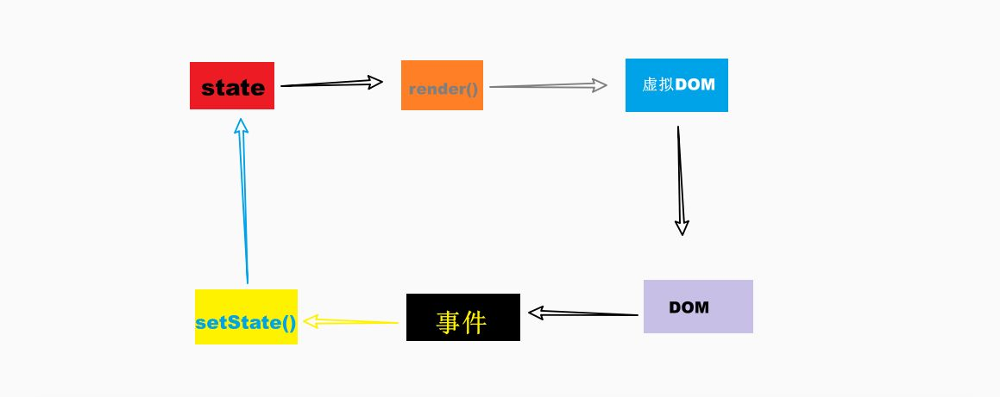

# React 入门


## 声明式UI

先统一一下概念，我们有两种编程方式：命令式和声明式。

我们可以像下面这样定义它们之间的不同：

- **命令式**：命令“机器”*如何*去做事情*(how)*，这样不管你想要的*是什么(what)*，它都会按照你的命令实现。
- **声明式**：告诉“机器”你想要的*是什么(what)*，让机器想出*如何*去做*(how)*。

#### 

```java
// Imperative style
b.setColor(red)
b.clearChildren()
ViewC c3 = new ViewC(...)
b.add(c3)
```

```dart
// Declarative style
return ViewB(
  color: red,
  child: ViewC(...),
)
```


其实声明式 UI 并不是什么新技术，早在 2006 年，微软就已经发布了其新一代界面开发框架 **WPF**，其采用了 XAML 标记语言，支持双向数据绑定、可复用模板等特性。


### 复杂点的例子
#### 远古Java Swing 示例代码

```java
private static void placeComponents(JPanel panel) {
    panel.setLayout(null);

    JLabel userLabel = new JLabel("User:");
    userLabel.setBounds(10,20,80,25);
    panel.add(userLabel);

    JTextField userText = new JTextField(20);
    userText.setBounds(100,20,165,25);
    panel.add(userText);
    JLabel passwordLabel = new JLabel("Password:");
    passwordLabel.setBounds(10,50,80,25);
    panel.add(passwordLabel);

    JPasswordField passwordText = new JPasswordField(20);
    passwordText.setBounds(100,50,165,25);
    panel.add(passwordText);

    JButton loginButton = new JButton("login");
    loginButton.setBounds(10, 80, 80, 25);
    panel.add(loginButton);
}
```

是否写过类似的代码？


去除临时变量，优化层次结构：

```Java
private static JPanel render() {
    return JPanel(
        JLabel("User:")
        	.Bounds(10,20,80,25),
        JTextField(20)
        	.Bounds(100,20,165,25),
        JLabel("Password:")
        	.Bounds(10,50,80,25),
        JPasswordField(20)
        	.Bounds(100,50,165,25),
        JButton("login")
        	.Bounds(10, 80, 80, 25),
    )
}
```

### 其他UI语言或框架

#### Jetpack Compose （google）

https://developer.android.com/jetpack/compose?hl=zh-cn

```kotlin
@Composable
fun SearchResult(...) {
  Row(...) {
    Image(...)
    Column(...) {
      Text(...)
      Text(..)
    }
  }
}
```


#### SwiftUI (apple)

https://developer.apple.com/documentation/swiftui/building-layouts-with-stack-views

```swift
struct ProfileView: View {
    var body: some View {
        ZStack(alignment: .bottom) {
            Image("ProfilePicture")
                .resizable()
                .aspectRatio(contentMode: .fit)
            HStack {
                VStack(alignment: .leading) {
                    Text("Rachael Chiseck")
                        .font(.headline)
                    Text("Chief Executive Officer")
                        .font(.subheadline)
                }
                Spacer()
            }
            .padding()
            .foregroundColor(.primary)
            .background(Color.primary
                            .colorInvert()
                            .opacity(0.75))
        }
    }
}
```

#### Flutter (google)

https://docs.flutter.dev/development/ui/layout/tutorial

```dart
Widget titleSection = Container(
  padding: const EdgeInsets.all(32),
  child: Row(
    children: [
      Expanded(
        /*1*/
        child: Column(
          crossAxisAlignment: CrossAxisAlignment.start,
          children: [
            /*2*/
            Container(
              padding: const EdgeInsets.only(bottom: 8),
              child: const Text(
                'Oeschinen Lake Campground',
                style: TextStyle(
                  fontWeight: FontWeight.bold,
                ),
              ),
            ),
            Text(
              'Kandersteg, Switzerland',
              style: TextStyle(
                color: Colors.grey[500],
              ),
            ),
          ],
        ),
      ),
      /*3*/
      Icon(
        Icons.star,
        color: Colors.red[500],
      ),
      const Text('41'),
    ],
  ),
);
```


#### QML  (qt)

https://doc.qt.io/qt-5/qmlfirststeps.html

```qml
//import related modules
import QtQuick 2.12
import QtQuick.Controls 2.12

//window containing the application
ApplicationWindow {

    visible: true

    //title of the application
    title: qsTr("Hello World")
    width: 640
    height: 480

    //menu containing two menu items
    menuBar: MenuBar {
        Menu {
            title: qsTr("File")
            MenuItem {
                text: qsTr("&Open")
                onTriggered: console.log("Open action triggered");
            }
            MenuItem {
                text: qsTr("Exit")
                onTriggered: Qt.quit();
            }
        }
    }

    //Content Area

    //a button in the middle of the content area
    Button {
        text: qsTr("Hello World")
        anchors.horizontalCenter: parent.horizontalCenter
        anchors.verticalCenter: parent.verticalCenter
    }
}
```

#### XAML (microsoft)

https://docs.microsoft.com/en-us/dotnet/desktop/wpf/xaml/?view=netdesktop-6.0

```xaml
<Button>
    <Button.Background>
        <SolidColorBrush Color="Blue"/>
    </Button.Background>
    <Button.Foreground>
        <SolidColorBrush Color="Red"/>
    </Button.Foreground>
    <Button.Content>
        This is a button
    </Button.Content>
</Button>
```

#### JSX (facebook)

```jsx
render() {
    return <JPanel>
        <JLabel bounds={[10,20,80,25]}>User:</JLabel>
        <JTextField bounds={[100,20,165,25]} length={20}/>
        <JLabel bounds={[10,50,80,25]}>Password:</JLabel>
        <JPasswordField bounds={[100,50,165,2]} length={20} />
        <JButton bounds={[10, 80, 80, 25]}>login</JButton>
    </JPanel>
}
```

## JSX 简介 

官方介绍 https://zh-hans.reactjs.org/docs/introducing-jsx.html

设想如下变量声明

```jsx
const element = <h1>Hello, world!</h1>;
```

上述这个有趣的标签语法既不是字符串也不是 HTML。

它被称为 JSX，是一个 JavaScript 的语法扩展。我们在 React 建议中配合使用 JSX，JSX 可以很好地描述 UI 应该呈现出它应有交互的本质形式。JSX 可能会使人联想到模板语言，但它具有 JavaScript 的全部功能。

#### 为什么使用 JSX？

React 认为渲染逻辑本质上与其他 UI 逻辑内在耦合，比如，在 UI 中需要绑定处理事件、在某些时刻状态发生变化时需要通知到 UI，以及需要在 UI 中展示准备好的数据。

React 并没有采用将*标记与逻辑进行分离到不同文件*这种人为地分离方式，而是通过将二者共同存放在称之为“组件”的松散耦合单元之中，来实现[*关注点分离*](https://en.wikipedia.org/wiki/Separation_of_concerns)。

**松散耦合**：耦合”表示要素之间相互联系，从而维持了一定程度的确定性；而“松散”又表明要素是快速变化的，又具有了一定程度的非确定性

[Babel JSX语法在线转义 ](https://babeljs.io/repl/#?browsers=defaults%2C%20not%20ie%2011%2C%20not%20ie_mob%2011&amp;build=&amp;builtIns=false&amp;corejs=3.21&amp;spec=false&amp;loose=false&amp;code_lz=MYewdgzgLgBApgGzgWzmWBeGAeAFgRgD4AJRBEAGhgHcQAnBAEwEJsB6AwgbgChRJY_KAEMAlmDh0YWRiGABXVOgB0AczhQAokiVQAQgE8AkowAUPGDADkdECChWeASl4AlOMOBQAIgHkAssp0aIySpogoaFBUQmISdC48QA&amp;debug=false&amp;forceAllTransforms=false&amp;shippedProposals=false&amp;circleciRepo=&amp;evaluate=false&amp;fileSize=false&amp;timeTravel=false&amp;sourceType=module&amp;lineWrap=true&amp;presets=react&amp;prettier=false&amp;targets=&amp;version=7.17.6&amp;externalPlugins=&amp;assumptions=%7B%7D)


# React 哲学


